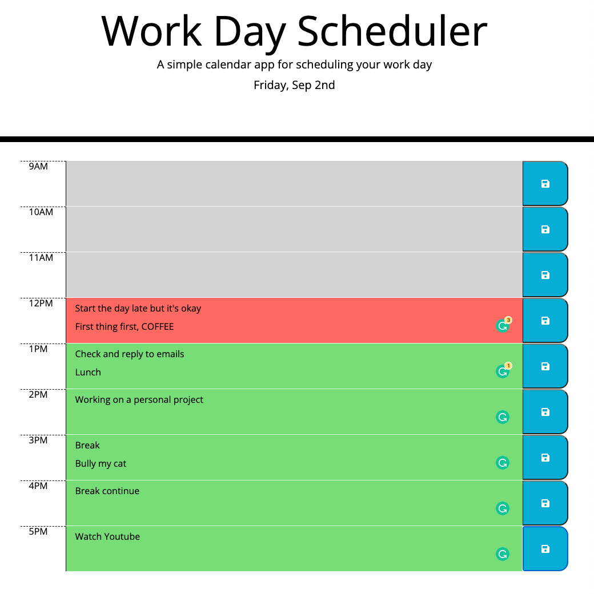

# Work Day Scheduler

---

## About

---

- This is a daily planner that allows users to save events for each hour of standard business hours.

- Each time block is color-coded to indicate whether it is in the past, present or future.
- The current day is displayed at the top of the calender.
- This app is built with HTML, CSS, Bootstrap, Moment.js and Javascript.

---

## Screenshot

---

## Link

[Click here to use the app!]()
